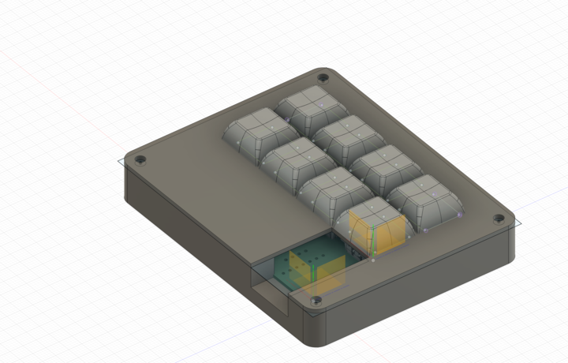
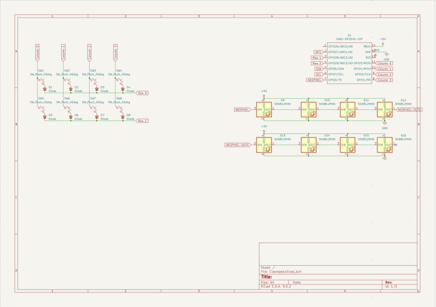

# clackpad

This is a 2x4 macropad with neopixel underlighting! It's supposed to help make me more productive(WIP) on my computer
| Item Name | Description | Quantity | Cost |
|-----------|-------------|----------|------|
| PCB | Main Macropad PCB | 5 | Unknown |
| Seeed Studio Xiao RP2040 | Main MCU | 1 | N/A Hackpad Provided |
| CherryMX Switches | Keyswitches, the buttons on the macropad | 8 | N/A Hackpad Provided |
| Diodes | Diodes for matrix to prevent ghosting | 8 | N/A Hackpad Provided |
| SK6812 MINI-E  | backlighting? flashing? neopixels! | 8 | N/A Hackpad Provided |

